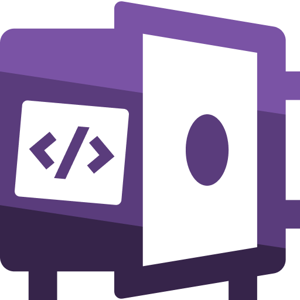
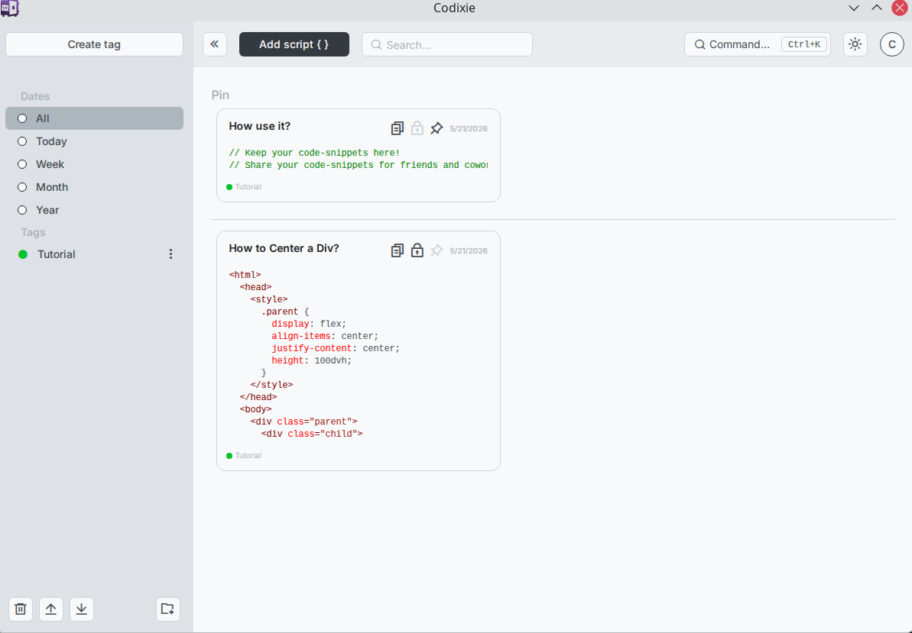

# Codixie





A desktop app for developers to store, organize, and quickly access code snippets.


## Features

- **Code snippets** -- Create, edit, pin, and delete code snippets with syntax highlighting powered by Monaco Editor.
- **Tags** -- Organize snippets with colored tags. Filter and search by tag or full-text query.
- **Comments** -- Attach comments to any snippet for inline notes and context.
- **Vaults** -- Data is stored as individual JSON files on disk (one per entity), so your vault lives in a plain folder you can sync with Dropbox, Google Drive, Git, or any file-based tool.
- **Conflict resolution** -- If a sync service creates duplicate files, Codixie detects them on load and auto-resolves by assigning new IDs.
- **File watching** -- External changes to the vault folder are picked up in real time via `chokidar`.
- **Dark and light themes** -- Toggle between themes with the mode switcher.
- **MCP server** -- Expose your snippets to AI tools via the [Model Context Protocol](https://modelcontextprotocol.io/). Codixie runs a read-only MCP server (stdio transport) so LLMs can query your vault without modifying it.
- **Cross-platform** -- Ships as `.exe` (Windows), `.dmg` (macOS), and `.AppImage` (Linux).

## Getting Started

### Prerequisites

- Node.js 20+
- npm

### Install and Run

```bash
npm ci --legacy-peer-deps
npm start
```

### Build Distributables

```bash
npm run make
```

Output artifacts land in `out/make/`.

### Lint

```bash
npm run lint
```

## MCP Server

Codixie exposes an MCP server so AI assistants and other MCP clients can read your vault.

**Stdio transport** (for CLI-based MCP clients):

```bash
codixie --mcp
```

### Available tools

| Tool             | Description                                       |
| ---------------- | ------------------------------------------------- |
| `get_vault_info` | Vault metadata and object counts                  |
| `list_tags`      | List all tags                                     |
| `get_tag`        | Read a single tag by ID                           |
| `list_snippets`  | List snippets with optional query and tag filters |
| `get_snippet`    | Read a single snippet with code and comments      |

### Resources

- `codixie://vault/meta` -- Vault metadata
- `codixie://tags/{id}` -- Tag JSON
- `codixie://snippets/{id}` -- Snippet JSON

All MCP operations are read-only.

## Data Storage

Each vault is a folder on disk containing:

```
<vault-path>/
  codixie/
    meta.json
    tags/
      <uuid>.json
    snippets/
      <uuid>.json
```

Every entity (tag, snippet) is stored as an independent JSON file. This makes vaults portable, diffable, and safe to sync with cloud storage or version control.

## License

MIT
